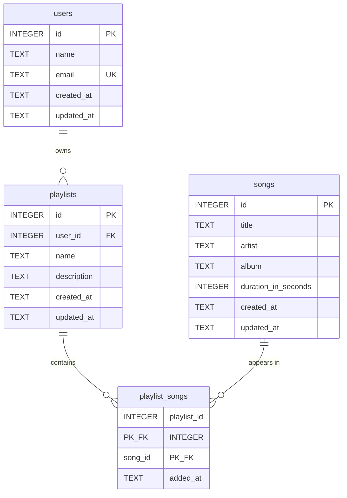

# LuftbornTask

A REST API for managing users, songs, and playlists, built with Express 5 and SQLite (`better-sqlite3`).

---

## Setup Guide

Follow these steps on **macOS** or **Windows** to install dependencies and run the project without common setup errors.

### Prerequisites

- **Node.js 20 or higher** (recommended). Express 5 requires Node 18+, but this project’s SQLite native addon (`better-sqlite3`) works most reliably on Node 20+.
- **npm** (included with Node.js)

Check your versions:

```bash
node -v
npm -v
```

### macOS

1. Install Node.js from [nodejs.org](https://nodejs.org/) (LTS) or via Homebrew:
  ```bash
   brew install node
  ```
2. If `npm install` fails while building `better-sqlite3`, install Xcode Command Line Tools:
  ```bash
   xcode-select --install
  ```
3. Then continue with the shared steps below.


### Windows

1. Install Node.js LTS from [nodejs.org](https://nodejs.org/). Prefer the installer that includes npm.
2. If `npm install` fails while compiling `better-sqlite3`, install [Visual Studio Build Tools](https://visualstudio.microsoft.com/visual-cpp-build-tools/) and select the **Desktop development with C++** workload.
3. Open a new terminal (PowerShell or Command Prompt) after installing build tools, then continue with the shared steps below.


### Install and run (macOS and Windows)

From the project root:

```bash
# 1. Install dependencies
npm install

# 2. Create the database, apply the schema, and seed sample data
npm run setup

# 3. Start the server
npm start
```

The server listens on `http://localhost:3000` by default.

**Optional:** create a `.env` file in the project root to change the port:

```env
PORT=3000
```

If `.env` is missing, the app still starts on port `3000`.

**Development mode** (auto-restart on file changes):

```bash
npm run dev
```


### Important notes

- `npm run setup` runs `init-db` then `seed`.
- `npm run init-db` **deletes** any existing `database/luftborn.db` and recreates it. Re-running it wipes local data; run `npm run seed` again afterward if you need sample data.
- You do **not** need to install or configure a separate database server. SQLite stores everything in a local file.


### Scripts


| Command           | Description                                  |
| ----------------- | -------------------------------------------- |
| `npm start`       | Start the server                             |
| `npm run dev`     | Start with auto-restart on file changes      |
| `npm run init-db` | Create a fresh database and apply the schema |
| `npm run seed`    | Insert sample data into the database         |
| `npm run setup`   | Run `init-db` and `seed` in sequence         |


---


## API Endpoints

**Base URL:** `http://localhost:3000`  
**Auth:** none  
**Content-Type:** `application/json` for request bodies  
**Error shape:** `{ "message": "<string>" }`

After `npm run setup`, seed data includes user `id: 1`, playlist `id: 1`, and songs `id: 1`–`5`.

---


### Users


#### `POST /users`

Create a user.

**Request body:**

```json
{
  "name": "Ziad elshafey",
  "email": "ziadelshafey@example.com"
}
```

**Success —** `201 Created`**:**

```json
{
  "message": "User Created Successfully",
  "user": {
    "id": 2,
    "name": "Ziad elshafey",
    "email": "ziadelshafey@example.com"
  }
}
```

---


#### `GET /users`

List all users. No request body.

**Success —** `200 OK`**:**

```json
{
  "message": "Users fetched successfully",
  "users": [
    {
      "id": 1,
      "name": "Ziad elshafey",
      "email": "ziadelshafey@example.com",
      "created_at": "2026-07-10 00:00:00",
      "updated_at": "2026-07-10 00:00:00"
    }
  ]
}
```

---


#### `GET /users/:userId`

Get a single user by ID. No request body.

**Example:** `GET /users/1`

**Success —** `200 OK`**:**

```json
{
  "message": "User fetched successfully",
  "user": {
    "id": 1,
    "name": "Ziad elshafey",
    "email": "ziadelshafey@example.com",
    "created_at": "2026-07-10 00:00:00",
    "updated_at": "2026-07-10 00:00:00"
  }
}
```

---


#### `GET /users/:userId/playlists`

Get a user’s playlists with nested songs. No request body.

**Example:** `GET /users/1/playlists`

**Success —** `200 OK`**:**

```json
{
  "message": "User playlists fetched successfully",
  "playlists": [
    {
      "id": 1,
      "name": "heya feen el far7a",
      "description": "my all time favs",
      "songs": [
        { "id": 1, "title": "Heseeny", "artist": "TUL8TE" },
        { "id": 2, "title": "Placebo", "artist": "Legecy" },
        { "id": 3, "title": "Lelly Yah", "artist": "Marwan Pablo" },
        { "id": 4, "title": "From The Start", "artist": "Laufey" },
        { "id": 5, "title": "Elwala Hamo geh", "artist": "Hamo ElMorshedy" }
      ]
    }
  ]
}
```

**Error —** `404 Not Found` if the user does not exist.

---


#### `DELETE /users/:userId`

Delete a user by ID. No request body. Deleting a user also deletes their playlists and playlist-song links (`ON DELETE CASCADE`).

**Example:** `DELETE /users/1`

**Success —** `200 OK`**:**

```json
{
  "message": "User with id 1 deleted successfully"
}
```

**Error —** `404 Not Found` if the user does not exist.

---


### Playlists


#### `POST /playlists`

Create a playlist for an existing user.

**Request body:**

```json
{
  "userId": 1,
  "name": "heya feen el far7a",
  "description": "my all time favs"
}
```

`description` is optional.

**Success —** `201 Created`**:**

```json
{
  "message": "Play List Created Successfully",
  "playList": {
    "id": 2,
    "userId": 1,
    "name": "heya feen el far7a",
    "description": "my all time favs"
  }
}
```

---


#### `POST /playlists/:playlistId/songs`

Add an existing song to a playlist.

**Example:** `POST /playlists/1/songs`

**Request body:**

```json
{
  "songId": 1
}
```

**Success —** `201 Created`**:**

```json
{
  "message": "Song added successfully!",
  "song": {
    "playlistId": 1,
    "songId": 1
  }
}
```

**Error —** `409 Conflict` if the song is already in the playlist.

---


#### `GET /playlists/:playlistId/songs`

List songs in a playlist. No request body.

**Example:** `GET /playlists/1/songs`

**Success —** `200 OK`**:**

```json
{
  "message": "songs fetched successfully",
  "songs": [
    {
      "id": 1,
      "title": "Heseeny",
      "artist": "TUL8TE",
      "album": "Narein",
      "duration_in_seconds": 214
    }
  ]
}
```

**Error —** `404 Not Found` if the playlist does not exist.

---


#### `PATCH /playlists/:playlistId`

Update a playlist’s name and/or description. At least one field is required.

**Example:** `PATCH /playlists/1`

**Request body:**

```json
{
  "name": "updated playlist name",
  "description": "updated description"
}
```

Both fields are optional, but at least one must be provided. Pass `"description": null` (or `""`) to clear the description.

**Success —** `200 OK`**:**

```json
{
  "message": "Playlist updated successfully",
  "playlist": {
    "id": 1,
    "user_id": 1,
    "name": "updated playlist name",
    "description": "updated description",
    "created_at": "2026-07-10 00:00:00",
    "updated_at": "2026-07-10 00:00:00"
  }
}
```

**Error —** `404 Not Found` if the playlist does not exist.

---


#### `DELETE /playlists/:playlistId`

Delete a playlist by ID. No request body. Playlist-song links are removed via `ON DELETE CASCADE`.

**Example:** `DELETE /playlists/1`

**Success —** `200 OK`**:**

```json
{
  "message": "Playlist deleted successfully"
}
```

**Error —** `404 Not Found` if the playlist does not exist.

---


### Songs


#### `POST /songs`

Create a song.

**Request body:**

```json
{
  "title": "Heseeny",
  "artist": "TUL8TE",
  "album": "Narein",
  "duration_in_seconds": 214
}
```

`album` is optional. `duration_in_seconds` must be a positive integer.

**Success —** `201 Created`**:**

```json
{
  "message": "Song Created Successfully",
  "song": {
    "id": 6,
    "title": "Heseeny",
    "artist": "TUL8TE",
    "album": "Narein",
    "duration_in_seconds": 214
  }
}
```

---


#### `PATCH /songs/:songId`

Update a song. All of `title`, `artist`, and `duration_in_seconds` are required; `album` is optional.

**Example:** `PATCH /songs/1`

**Request body:**

```json
{
  "title": "Heseeny (Remix)",
  "artist": "TUL8TE",
  "album": "Narein",
  "duration_in_seconds": 220
}
```

**Success —** `200 OK`**:**

```json
{
  "message": "Song updated successfully",
  "song": {
    "id": 1,
    "title": "Heseeny (Remix)",
    "artist": "TUL8TE",
    "album": "Narein",
    "duration_in_seconds": 220
  }
}
```

**Error —** `404 Not Found` if the song does not exist.

---


#### `DELETE /songs/:songId`

Delete a song by ID. No request body. Removing a song also removes it from all playlists (`ON DELETE CASCADE`).

**Example:** `DELETE /songs/1`

**Success —** `200 OK`**:**

```json
{
  "message": "Song deleted successfully"
}
```

**Error —** `404 Not Found` if the song does not exist.

---


### Endpoint summary


| Method   | Endpoint                       | Description                              |
| -------- | ------------------------------ | ---------------------------------------- |
| `POST`   | `/users`                       | Create a user                            |
| `GET`    | `/users`                       | List all users                           |
| `GET`    | `/users/:userId`               | Get a single user                        |
| `GET`    | `/users/:userId/playlists`     | Get a user’s playlists with nested songs |
| `DELETE` | `/users/:userId`               | Delete a user                            |
| `POST`   | `/playlists`                   | Create a playlist                        |
| `POST`   | `/playlists/:playlistId/songs` | Add a song to a playlist                 |
| `GET`    | `/playlists/:playlistId/songs` | List songs in a playlist                 |
| `PATCH`  | `/playlists/:playlistId`       | Update a playlist                        |
| `DELETE` | `/playlists/:playlistId`       | Delete a playlist                        |
| `POST`   | `/songs`                       | Create a song                            |
| `PATCH`  | `/songs/:songId`               | Update a song                            |
| `DELETE` | `/songs/:songId`               | Delete a song                            |


---


## Database Schema




**Relationships and constraints:**

- A **user** owns many **playlists** (`playlists.user_id` → `users.id`).
- **Playlists** and **songs** are many-to-many through `playlist_songs`.
- Deleting a user cascades to their playlists; deleting a playlist or song cascades to related `playlist_songs` rows.
- `users.email` is unique.
- Playlist names are unique per user (`UNIQUE(user_id, name)`).
- A song can appear at most once in a given playlist (composite primary key on `playlist_id`, `song_id`).
- `songs.duration_in_seconds` must be greater than `0`.

---


## Why SQLite?

A relational database fits this domain because the components are related to each other: users have playlists, and playlists contain songs.

SQLite was chosen to make local testing easy without running a separate database server or configuring credentials. This app is not intended for production.

---


## AI Usage

An OpenCode agent was used to:

1. Suggest the project file skeleton
2. Generate DB initialization scripts
3. Input validation and error handler utilities
4. generating the readme file

---


## Project Structure

```
├── database/
│   ├── schema.sql              # Table definitions
│   ├── seed.sql                # Sample data
│   └── luftborn.db             # SQLite database file (generated)
├── scripts/
│   ├── initDb.js               # Database setup script
│   └── seed.js                 # Seed data script
├── src/
│   ├── app.js                  # Express app setup
│   ├── server.js               # Entry point
│   ├── db.js                   # Database connection
│   ├── controllers/
│   ├── services/
│   ├── repositories/
│   ├── routes/
│   │   ├── userRoutes.js
│   │   ├── songRoutes.js
│   │   └── playlistRoutes.js
│   └── utils/
│       ├── httpErrors.js
│       └── validate.js
└── package.json
```

